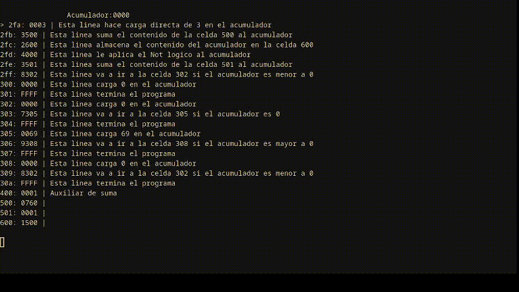

# Maquina elemental Abacus
Este pequeno programa es un interprete de la Maquina Elemental Abacus usada en la materia "Organizacion del Computador" de la Catedra de Benitez. Especificada aqui: https://drive.google.com/file/d/1rz3_wATokWx7XaGZR4H13a8Iq0fjcuaz/view

Pull Request mas que  bienvenidos! (Particularmente sobre los TODO's)

## Que hace?
1. Te permite escribir y ejecutar un codigo Abacus (Con comentario)
	1. El codigo tiene que estar en un archivo .abs
2. Ver el contenido del acumulador
3. Ver linea a linea lo que la maquina interpreta

## TODO (en orden de prioridad):
- [ ] Importar un excel con codigo Abacus y ejecutarlo
- [ ] Tener funciones que permitan crear estructuras ya pre-hechas (como un creador de lista que te permita crear una lista de x elementos con valores de ejemplo)
- [X] Que escriba el resultado en otro archivo
- [ ] Tener errores propios y mas lindos (en vez de Keyerror)
- [ ] Crear un lsp (Ultimo)
